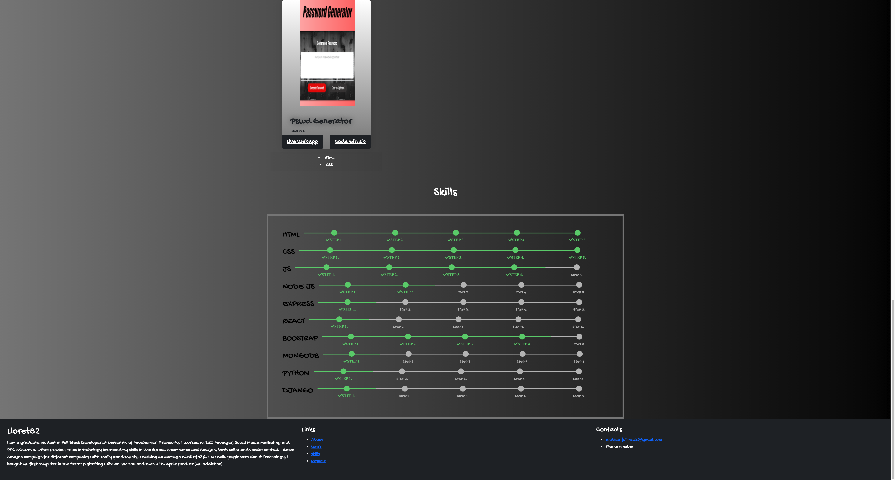

# Lloret82 Professional Portfolio

## Table of Contents

* [Description](#Description)
* [Links](#links)
* [Screenshots](#Screenshots)
* [Installation](#installation)
* [Usage](#Usage)
* [Licence](#Licence)
* [Badge](#Badge)

## Description

#### About Me
I am a graduate student in Full Stack Developer at University of Manchester. Previously, I worked as SEO Manager, Social Media Marketing and PPC executive. Other previous roles in technlogy improved my skills in Wordpress, e-commerce and Amazon, both seller and vendor central. I drove Amazon campaign for different companies with really good results, reaching an average ACoS of 13%. I'm really passionate about Technology, i bought my first computer in the far 1991 starting with an IBM 186 and then with Apple product (my addiction)

## What technology has been used
* HTML
* CSS
* Javascript
* Bootstrap

## Links

* [Code Repository](https://github.com/Lloret82/Personal_Portfolio)
* [Live website](https://lloret82.github.io/Professional_Portfolio/)

## Screenshots

 
 

## Installation

#### _Installation not needed_

## Usage

#### _The page can be viewed in both desktop and mobile version_

## Licence

#### Copyright (c) [2021] [Andrea Di Bartolomeo]
Permission is hereby granted, free of charge, to any person obtaining a copy
of this software and associated documentation files (the "Software"), to deal
in the Software without restriction, including without limitation the rights
to use, copy, modify, merge, publish, distribute, sublicense, and/or sell
copies of the Software, and to permit persons to whom the Software is
furnished to do so, subject to the following conditions:
The above copyright notice and this permission notice shall be included in all
copies or substantial portions of the Software.
THE SOFTWARE IS PROVIDED "AS IS", WITHOUT WARRANTY OF ANY KIND, EXPRESS OR
IMPLIED, INCLUDING BUT NOT LIMITED TO THE WARRANTIES OF MERCHANTABILITY,
FITNESS FOR A PARTICULAR PURPOSE AND NONINFRINGEMENT. IN NO EVENT SHALL THE
AUTHORS OR COPYRIGHT HOLDERS BE LIABLE FOR ANY CLAIM, DAMAGES OR OTHER
LIABILITY, WHETHER IN AN ACTION OF CONTRACT, TORT OR OTHERWISE, ARISING FROM,
OUT OF OR IN CONNECTION WITH THE SOFTWARE OR THE USE OR OTHER DEALINGS IN THE
SOFTWARE_

## Badge

